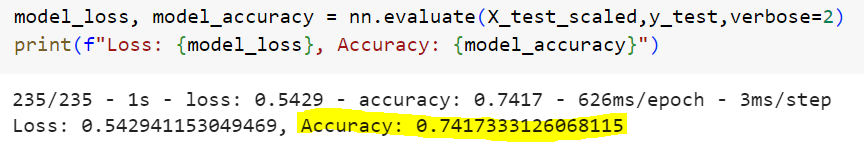
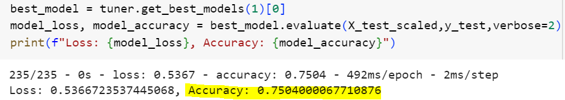
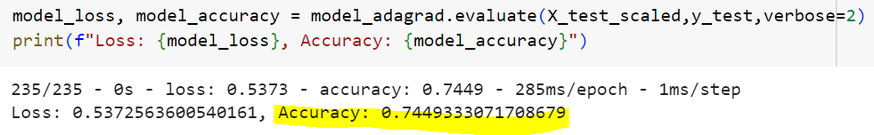
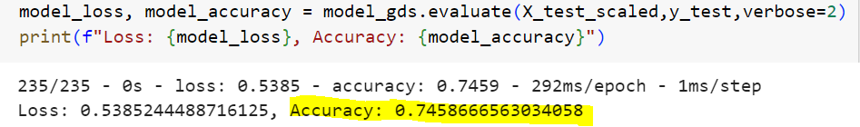

# deep-learning-challenge
## Module 21 Neural Network Models

There were 4 Neural Network models used to optimize the results in  findng out the best applicants to be funded by Alphabet Soup.  These candidates will have the best chance of success in their ventures.

Due to the time constraints, data used for training & testing were limited to 30,000.

## OPTIMIZATION MODELS

### 1. Adam Optimizer (AlphabetSoupCharity.h5)
This prediction optimizer is not quite accurate with an accuracy score of only 74.17% and a data loss of about 54.29%

### 2. Adam Optimizer using Keras Tuner ** Optimum model (AlphabetSoupCharity-Optimization1.h5)
This prediction optimizer has a better accuracy score of 75.04% and a data loss of about 53.66%.  The model selects the optimum number of neurons & layers to use based on the provided range.

### 3. Adagrad Optimizer (AlphabetSoupCharity-Optimization2.h5)
This prediction optimizer has an accuracy score of 74.49% and a data loss of about 53.72%

### 4. Gradient Descent Optimizer (AlphabetSoupCharity-Optimization3.h5)
This prediction optimizer has an accuracy score of 74.58% and a data loss of about 53.85%

## SUMMARY
The different Neural Network optimization methods used did not have a material difference.  The optimum accuracy scores were only in ranges between 73% and 74%.  Loss of data was quite material, which is at 53% to 54%.  This tells us that the prediction models with over 50% of data (loss) not being accounted for is quite unreliable.  
However, with the use of Keras tuner and adam optimizer in model# 2, the accuracy score was able to pass at 75.04%.  Data loss was a bit minimized, making this the optimum model to use in helping Alphabet Soup decide which applicants to fund, those who will have a better success in their ventures.

